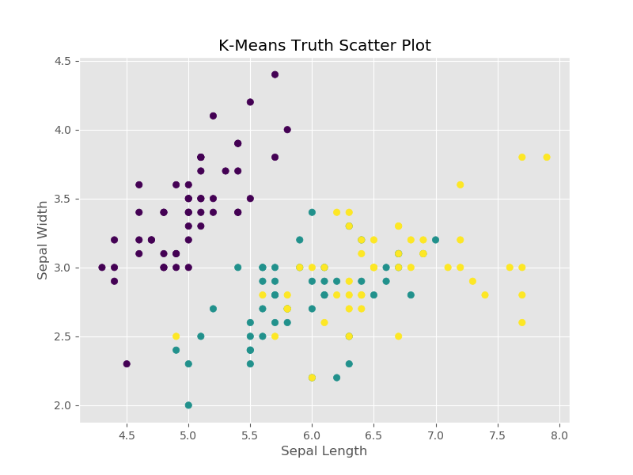
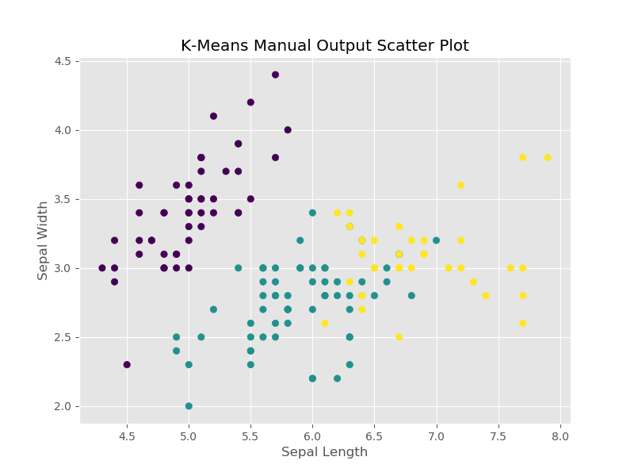

# K-Means Clustering Algorithm
This is an implementation of K-Means clustering algorithm along with the K-Means++ seeding technique using NumPy. Further, a comparison of the manual implementation is made against the SK Learn implementation of the algorithm. The Iris dataset is used for this comparison.

## Clustering Graphs
### Iris Dataset True Clusters

### SK Learn K-Means Clusters

### Manual Implementation Clusters

### Confusion Matrix - Iris True Clusters v/s Manual Implementation Clusters

||0|1|2|
|:---:|:---:|:---:|:---:|
|0|50|0|0|
|1|0|48|2|
|2|0|14|36|

### Confusion Matrix - SK Learn Clusters v/s Manual Implementation Clusters

||0|1|2|
|:---:|:---:|:---:|:---:|
|0|50|0|0|
|1|0|62|0|
|2|0|0|38|
